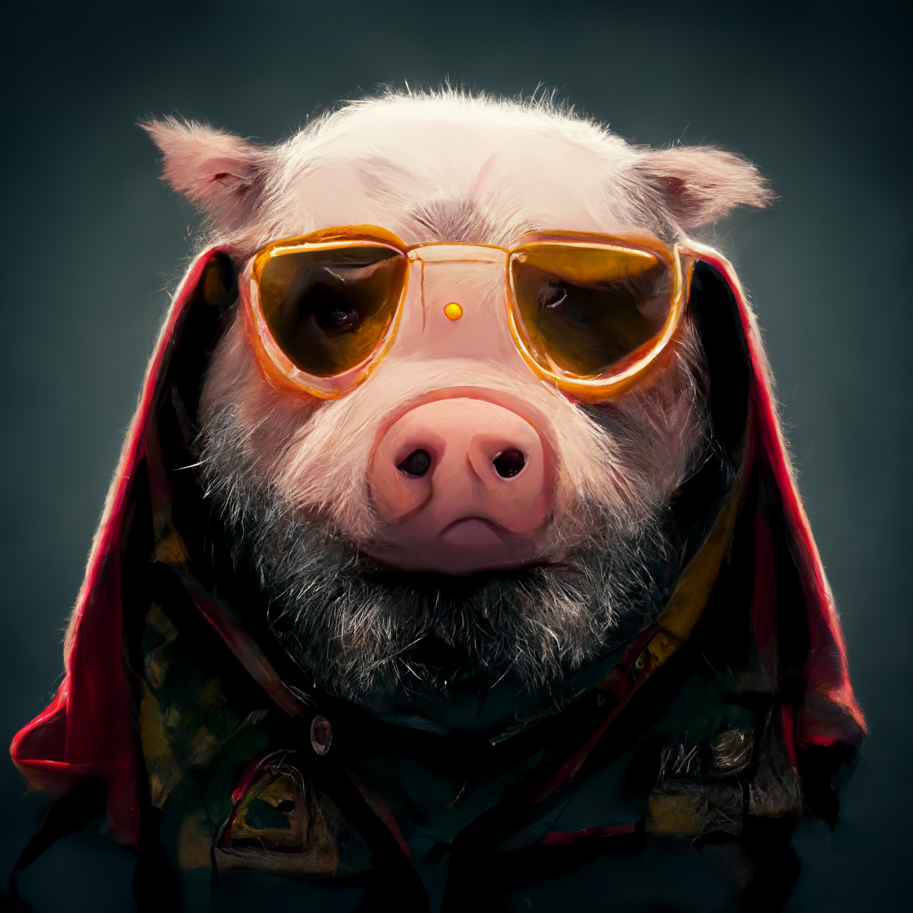

# PPPSBot



A simple music bot project. Our goal is make a simple and efficiently music bot for dicord servers.

- [Development](#development)
    - [Requirements](#requirements)
    - [Configuration](#configuration)
    - [Application Execution](#application-execution)
    - [Tests](#tests)
    
    
## Development

### Requirements

```

* Python >= 3.7v
* pip

```   

### Configuration

List of environment variables required to start the application. (Obs: An example file can be found in the apps root called .env.example)

| Variable               | Description                                       |   Type           | Required |  Default Value   |
| ---------------------- | :-----------------------------------------------: | :--------------: | :-------:| :-------------:  |
| TOKEN                  | Discord bot's token                               |  Text            |    Yes   |    Empty         |
| DISCORD_SERVER         | Official discord server invite link               |  Text            |    Yes   |    Empty         |
| GUILD_ID_ADD_MEMBER    | Default Guild ID to add roles when someone joins  |  Number          |    Yes   |    Empty         |
| ROLE_ID_ADD_MEMBER     | Role ID to be added when someone joins            |  Number          |    Yes   |    Empty         |
| BOT_ROLE_ID_ADD_MEMBER | Role ID to be added when bot joins                |  Number          |    Yes   |    Empty         |
| USERS_ID_ABLE_TO_SYNC  | Users id to be able to sync global slash commands |  List<Number>[;] |    No    |    Empty         |


#### Application Execution:

To execute the application:
```
* pip install -r requirements.txt (Only first time executing it)
* python main.py
```

### Tests

```bash
# unit tests
--

```
